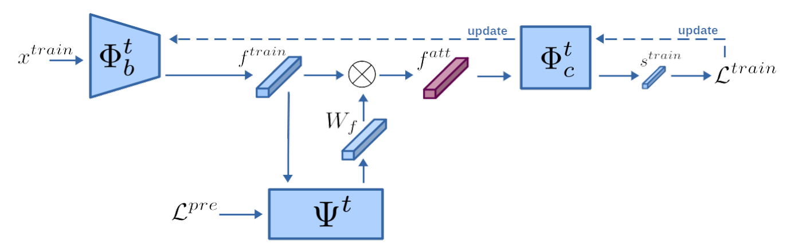

# Learning advisor networks for noisy image classification

This repo contains the code of "Learning advisor networks for noisy image classification",
_Simone Ricci, Tiberio Uricchio and Alberto Del Bimbo_. (Pusblished as Poster at ICIAP 2021)

<p align="center">
  
</p>

## Abstract

In this paper, we introduced the novel concept of advisor network to address the problem of noisy labels in image classification. Deep neural networks (DNN) are prone to performance reduction and overfitting problems on training data with noisy annotations. Weighting loss methods aim to mitigate the influence of noisy labels during the training, completely removing their contribution. This discarding process prevents DNNs from learning wrong associations between images and their correct labels but reduces the amount of data used, especially when most of the samples have noisy labels. Differently, our method weighs the feature extracted directly from the classifier without altering the loss value of each data. The advisor helps to focus only on some part of the information present in mislabeled examples, allowing the classifier to leverage that data as well. We trained it with a meta-learning strategy so that it can adapt throughout the training of the main model. We tested our method on CIFAR10 and CIFAR100 with synthetic noise, and on Clothing1M which contains real-world noise, reporting state-of-the-art results.


## Install and Train

Install the repo and the required dependencies and train with default parameters
```shell
git clone https://github.com/z3n0e/MFRW
cd clothing
# train with default parameters
python train.py
```

## Authors
- Simone Ricci <simone.ricci (at) unifi.it>[](https://github.com/z3n0e)
- Tiberio Uricchio <tiberio.uricchio (at) unifi.it>
- Alberto Del Bimbo <alberto.delbimbo (at) unifi.it>

## Citing

Please kindly cite our paper if this repository is helpful.

```
@inproceedings{ricci2022learning,
  title={Learning Advisor Networks for Noisy Image Classification},
  author={Ricci, Simone and Uricchio, Tiberio and Bimbo, Alberto Del},
  booktitle={International Conference on Image Analysis and Processing},
  pages={442--453},
  year={2022},
  organization={Springer}
}
```